# 🏗️ Sarah - AI Support Agent Architecture

## System Overview

This diagram shows the complete architecture of Sarah, the AI customer support agent for Aven, including text chat, voice interactions, meeting scheduling, and knowledge management.

```mermaid
graph TB
    %% User Interface Layer
    subgraph "Frontend Layer"
        UI[React Frontend<br/>localhost:3000]
        subgraph "UI Components"
            ChatUI[Chat Interface]
            VoiceUI[Voice Button]
            TypingUI[Typing Indicator<br/>"Sarah is typing..."]
            WelcomeUI[Welcome Screen<br/>"Welcome! I'm Sarah 👋"]
        end
    end

    %% API Gateway Layer
    subgraph "API Gateway"
        Express[Express.js Server<br/>localhost:5001]
        subgraph "API Routes"
            ChatAPI[/api/chat]
            VapiAPI[/api/vapi]
            MeetingAPI[/api/meetings]
            AdminAPI[/api/admin]
            EvalAPI[/api/evaluation]
        end
    end

    %% Core Services Layer
    subgraph "Core Services"
        subgraph "AI & Knowledge"
            ChatService[Chat Service<br/>Message Processing]
            KnowledgeService[Knowledge Service<br/>RAG System]
            OpenAIService[OpenAI Service<br/>GPT-4 + Embeddings]
        end
        
        subgraph "Specialized Services"
            MeetingService[Meeting Service<br/>Slot Management]
            VapiService[Vapi Service<br/>Voice Integration]
            GuardrailsService[Guardrails Service<br/>Safety Checks]
        end
    end

    %% External Services
    subgraph "External APIs"
        OpenAI[OpenAI API<br/>GPT-4 + ada-002]
        Vapi[Vapi API<br/>Voice Assistant]
        Pinecone[Pinecone Vector DB<br/>Knowledge Base]
    end

    %% Data Layer
    subgraph "Data Sources"
        subgraph "Aven Knowledge"
            FAQData[FAQ Data<br/>JSON Files]
            ProductData[Product Data<br/>Scraped Content]
            EnhancedData[Enhanced Data<br/>Detailed Info]
        end
        
        subgraph "Meeting Data"
            Slots[Available Slots<br/>30 Days Ahead]
            Bookings[Meeting Bookings<br/>In-Memory Storage]
        end
    end

    %% Connections - Frontend to API
    UI --> Express
    ChatUI --> ChatAPI
    VoiceUI --> VapiAPI

    %% Connections - API to Services
    ChatAPI --> ChatService
    VapiAPI --> VapiService
    MeetingAPI --> MeetingService

    %% Connections - Services to External APIs
    OpenAIService --> OpenAI
    VapiService --> Vapi
    KnowledgeService --> Pinecone

    %% Connections - Services to Data
    KnowledgeService --> FAQData
    KnowledgeService --> ProductData
    KnowledgeService --> EnhancedData
    MeetingService --> Slots
    MeetingService --> Bookings

    %% Internal Service Connections
    ChatService --> KnowledgeService
    ChatService --> GuardrailsService
    KnowledgeService --> OpenAIService
    VapiService --> GuardrailsService

    %% Styling
    classDef frontend fill:#e1f5fe,stroke:#01579b,stroke-width:2px
    classDef api fill:#f3e5f5,stroke:#4a148c,stroke-width:2px
    classDef service fill:#e8f5e8,stroke:#1b5e20,stroke-width:2px
    classDef external fill:#fff3e0,stroke:#e65100,stroke-width:2px
    classDef data fill:#fce4ec,stroke:#880e4f,stroke-width:2px

    class UI,ChatUI,VoiceUI,TypingUI,WelcomeUI frontend
    class Express,ChatAPI,VapiAPI,MeetingAPI,AdminAPI,EvalAPI api
    class ChatService,KnowledgeService,OpenAIService,MeetingService,VapiService,GuardrailsService service
    class OpenAI,Vapi,Pinecone external
    class FAQData,ProductData,EnhancedData,Slots,Bookings data
```

## Detailed Component Architecture

```mermaid
graph LR
    %% User Interaction Flow
    subgraph "User Interaction"
        User[👤 User]
        TextInput[💬 Text Chat]
        VoiceInput[🎙️ Voice Chat]
    end

    %% Frontend Processing
    subgraph "Frontend Processing"
        ReactApp[React App<br/>Material-UI]
        ChatContext[Chat Context<br/>State Management]
        VapiContext[Vapi Context<br/>Voice State]
    end

    %% Backend Processing
    subgraph "Backend Processing"
        subgraph "Request Handling"
            ExpressRouter[Express Router]
            Middleware[Security Middleware<br/>Rate Limiting, CORS]
        end
        
        subgraph "AI Processing"
            MessageProcessor[Message Processor<br/>Safety Checks]
            RAGEngine[RAG Engine<br/>Knowledge Retrieval]
            FunctionCaller[Function Caller<br/>Meeting Scheduling]
        end
        
        subgraph "Response Generation"
            ResponseBuilder[Response Builder<br/>Natural Language]
            ContextManager[Context Manager<br/>Conversation History]
        end
    end

    %% Data Flow
    subgraph "Data Flow"
        VectorDB[(Pinecone<br/>Vector Database)]
        KnowledgeBase[(Knowledge Base<br/>Aven Data)]
        MeetingDB[(Meeting Data<br/>Slots & Bookings)]
    end

    %% External Services
    subgraph "External Services"
        OpenAIAPI[OpenAI API<br/>GPT-4 + Embeddings]
        VapiAPI[Vapi API<br/>Voice Processing]
    end

    %% User Flow
    User --> TextInput
    User --> VoiceInput
    
    TextInput --> ReactApp
    VoiceInput --> ReactApp
    
    ReactApp --> ChatContext
    ReactApp --> VapiContext
    
    ChatContext --> ExpressRouter
    VapiContext --> ExpressRouter
    
    ExpressRouter --> Middleware
    Middleware --> MessageProcessor
    
    MessageProcessor --> RAGEngine
    RAGEngine --> FunctionCaller
    FunctionCaller --> ResponseBuilder
    
    ResponseBuilder --> ContextManager
    ContextManager --> ReactApp
    
    %% Data Connections
    RAGEngine --> VectorDB
    RAGEngine --> KnowledgeBase
    FunctionCaller --> MeetingDB
    
    %% External API Connections
    RAGEngine --> OpenAIAPI
    VapiContext --> VapiAPI

    %% Styling
    classDef user fill:#ffebee,stroke:#c62828,stroke-width:2px
    classDef frontend fill:#e3f2fd,stroke:#1565c0,stroke-width:2px
    classDef backend fill:#f1f8e9,stroke:#33691e,stroke-width:2px
    classDef data fill:#fce4ec,stroke:#ad1457,stroke-width:2px
    classDef external fill:#fff8e1,stroke:#f57f17,stroke-width:2px

    class User,TextInput,VoiceInput user
    class ReactApp,ChatContext,VapiContext frontend
    class ExpressRouter,Middleware,MessageProcessor,RAGEngine,FunctionCaller,ResponseBuilder,ContextManager backend
    class VectorDB,KnowledgeBase,MeetingDB data
    class OpenAIAPI,VapiAPI external
```



## Meeting Scheduling Flow


## Knowledge Base Architecture


## Security & Guardrails Architecture


## Technology Stack


## Key Features Highlighted

- **🤖 AI-Powered**: GPT-4 with RAG for accurate responses
- **🎙️ Voice Integration**: Vapi for voice conversations
- **📅 Meeting Scheduling**: Automated booking with function calling
- **🛡️ Security**: Comprehensive guardrails and safety checks
- **📱 Responsive UI**: Modern React interface with Material-UI
- **🔍 Knowledge Base**: Vector search through Aven's data
- **⚡ Real-time**: WebSocket support for live interactions
- **📊 Analytics**: Meeting statistics and conversation tracking 