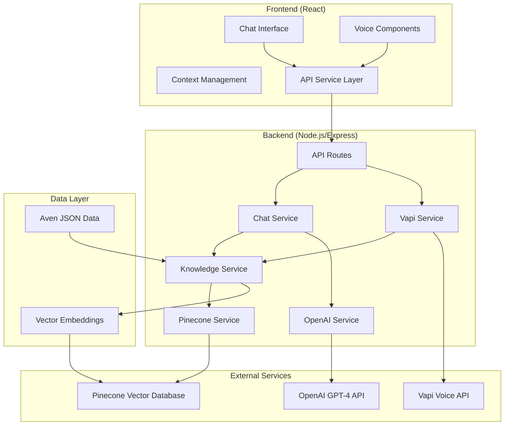

# Context and Boundaries Documentation

## What We Have Built

### Project Overview
We have built a **comprehensive AI Customer Support Agent for Aven**, a fintech company that offers HELOC-backed credit cards. This is a full-stack application that uses advanced Retrieval-Augmented Generation (RAG) technology to provide accurate, contextual responses to customer inquiries about Aven's financial products and services.

### Core Functionality
- **Intelligent Chat Interface**: A ChatGPT-style conversational interface with professional Aven branding
- **RAG-Powered Responses**: Uses Pinecone vector database to retrieve relevant context and OpenAI GPT-4 for natural language generation
- **Knowledge Base Management**: Comprehensive system for processing, embedding, and querying Aven's support documentation
- **Real-time Communication**: Seamless chat experience with typing indicators and smooth animations
- **Professional UI/UX**: Clean, responsive interface optimized for customer support scenarios
- **Voice Chat Integration**: Vapi-powered voice conversations with real-time transcription and function calling

### Key Features Implemented
✅ **Text-based Chat System** with natural language processing  
✅ **Vector Database Integration** for semantic search capabilities  
✅ **OpenAI GPT-4 Integration** for intelligent response generation  
✅ **Knowledge Base Loading** from Aven's FAQ and support documentation  
✅ **Rate Limiting and Security** middleware for production readiness  
✅ **Responsive Material-UI Design** with Aven brand colors (white/black theme)  
✅ **Chat History and Session Management** for continuous conversations  
✅ **Smooth Animations and Transitions** for enhanced user experience  
✅ **Error Handling and Fallback Systems** for reliability  
✅ **Voice Chat Capabilities** with Vapi integration and function calling  
✅ **Optimized Backend Startup** with non-blocking service initialization  
✅ **Comprehensive Debug Logging** for development and monitoring  

## System Architecture

### High-Level Architecture



### Component Interactions

#### 1. **Frontend Layer (React)**
- **Chat Interface**: Main user-facing chat component with message display
- **Voice Components**: Vapi-powered voice chat with real-time transcription
- **State Management**: React Context for global chat state and message history
- **API Service**: Abstraction layer for backend communication
- **UI Components**: Modular components for sidebar, input, typing indicators, and message bubbles

#### 2. **Backend API Layer (Express.js)**
- **Route Handlers**: RESTful endpoints for chat, admin, and Vapi operations
- **Chat Service**: Orchestrates the RAG pipeline and response generation
- **Knowledge Service**: Manages document processing, embedding, and retrieval
- **OpenAI Service**: Handles GPT-4 API calls and response formatting
- **Pinecone Service**: Vector database operations and semantic search
- **Vapi Service**: Voice chat integration with assistant management and function calling

#### 3. **External Service Integration**
- **OpenAI API**: GPT-4 for chat completions and text-embedding-3-large for document embeddings
- **Pinecone Database**: Vector storage and semantic similarity search
- **Vapi API**: Voice conversation management and real-time transcription
- **Rate Limiting**: Protection against API abuse and cost management

### Data Flow

#### Text Chat Flow:
1. **User Input** → Frontend captures message and sends to backend
2. **Context Retrieval** → Backend queries Pinecone for relevant knowledge base entries
3. **Response Generation** → OpenAI GPT-4 generates response using retrieved context
4. **Response Delivery** → Backend sends formatted response back to frontend
5. **UI Update** → Frontend displays response with animations and updates chat history

#### Voice Chat Flow:
1. **Voice Input** → Vapi captures and transcribes user speech
2. **Function Call** → Vapi triggers knowledge search function via webhook
3. **Knowledge Retrieval** → Backend searches Pinecone and formats voice-optimized response
4. **Voice Response** → Vapi synthesizes speech and delivers to user
5. **Real-time Updates** → Frontend displays transcription and call status

### Enhanced Backend Architecture

#### **Non-Blocking Startup Process**:
```
Server Startup (1-2 seconds)
├── Express App Initialization
├── Middleware Setup (Security, CORS, Rate Limiting)
├── Route Registration (Chat, Admin, Vapi)
├── Server Port Binding
└── Async Service Initialization
    ├── Vapi Assistant Creation (with timeout)
    ├── Knowledge Base Verification
    └── Health Check Endpoint Activation
```

#### **Service Initialization Flow**:
```
initializeServices() [Non-blocking]
├── Check Vapi Configuration
├── Initialize with 30-second timeout
├── Create/Verify Assistant
├── Log Detailed Progress
└── Enable Voice Features
```

## System Boundaries

### What Is Included (Internal Components)

#### ✅ Core Application
- **Complete Chat Interface**: Full conversational UI with Aven branding
- **RAG Implementation**: End-to-end retrieval-augmented generation system
- **Knowledge Base**: Processed Aven FAQ and support documentation
- **API Layer**: All necessary endpoints for chat, admin, and voice operations
- **State Management**: Complete frontend state handling and persistence
- **Security Middleware**: Rate limiting, CORS, input validation
- **Voice Integration**: Vapi service with assistant management and function calling

#### ✅ Development Infrastructure
- **Build System**: Configured for both development and production
- **Environment Management**: Configuration for different deployment environments
- **Documentation**: Comprehensive setup and usage instructions
- **Testing Setup**: Jest configuration and basic test structure
- **Debug Logging**: Comprehensive logging for development and monitoring
- **Error Recovery**: Timeout protection and graceful degradation

### What Is External (Dependencies)

#### 🔌 Third-Party Services
- **OpenAI API**: External service for LLM capabilities
  - Used for: Chat completions and text embeddings
  - Boundary: We send prompts/text, receive responses/embeddings
  
- **Pinecone Database**: External vector database service
  - Used for: Vector storage and similarity search
  - Boundary: We send queries/vectors, receive search results

- **Vapi API**: External voice conversation service
  - Used for: Voice chat, transcription, and speech synthesis
  - Boundary: We send assistant config/webhooks, receive voice interactions

#### 🔌 External Libraries and Frameworks
- **React**: Frontend framework and component system
- **Material-UI**: UI component library and theming
- **Express.js**: Backend web framework and middleware
- **Node.js**: Runtime environment for backend services

### What Is NOT Included (Out of Scope)

#### ❌ Future Enhancements (Planned but Not Implemented)
- **Advanced Evaluation System**: 50+ test questions for accuracy assessment
- **PII Detection**: Personal information filtering and protection
- **Meeting Scheduling**: Tool calls for appointment booking
- **Advanced Analytics**: Usage metrics and conversation analytics
- **Multi-language Support**: Internationalization and localization

#### ❌ Infrastructure and Deployment (External)
- **Production Hosting**: Server deployment and scaling
- **Database Management**: Pinecone index management and scaling
- **API Key Management**: Secure credential storage and rotation
- **Monitoring and Logging**: Application performance monitoring
- **CI/CD Pipeline**: Automated testing and deployment

#### ❌ Business Logic (Domain-Specific)
- **Aven's Internal Systems**: CRM, payment processing, loan management
- **Regulatory Compliance**: Financial service compliance requirements
- **Customer Authentication**: User identity verification and authorization
- **Transaction Processing**: Actual financial operations and integrations

### Integration Points

#### API Boundaries
- **Frontend ↔ Backend**: RESTful HTTP API on port 5001
- **Backend ↔ OpenAI**: HTTPS API calls to OpenAI endpoints
- **Backend ↔ Pinecone**: HTTPS API calls to Pinecone vector database
- **Backend ↔ Vapi**: Webhook-based integration for voice conversations

#### Data Boundaries
- **Input**: User chat messages, voice audio, and admin commands
- **Output**: AI-generated responses, voice synthesis, and system status information
- **Storage**: Vector embeddings in Pinecone, no persistent user data storage
- **Processing**: Text processing, embedding generation, semantic search, and voice transcription

### Scalability and Limitations

#### Current System Limits
- **Concurrent Users**: Limited by Express.js single-thread and API rate limits
- **Knowledge Base Size**: Currently ~45 documents, expandable within Pinecone limits
- **Response Time**: Dependent on OpenAI, Pinecone, and Vapi API response times
- **Context Window**: Limited by GPT-4 token limits (~8K tokens)
- **Voice Chat**: Limited by Vapi plan limits and 11Labs character usage

#### Performance Optimizations
- **Server Startup**: Optimized to 1-2 seconds with non-blocking initialization
- **Timeout Protection**: 30-second timeout prevents infinite hanging
- **Error Recovery**: Graceful degradation when services fail
- **Debug Logging**: Comprehensive monitoring for performance issues

#### Scaling Considerations
- **Horizontal Scaling**: Would require load balancing and session management
- **Database Scaling**: Pinecone handles vector database scaling automatically
- **Voice Scaling**: Vapi handles voice infrastructure scaling
- **Caching**: Could add Redis for response caching and session storage
- **CDN Integration**: For frontend asset delivery and performance optimization

## Security and Privacy Considerations

### Implemented Security Measures
- **Rate Limiting**: Prevents API abuse and controls costs
- **Input Validation**: Basic sanitization of user inputs
- **CORS Configuration**: Controlled cross-origin resource sharing
- **Environment Variables**: Secure API key management
- **Webhook Security**: Vapi webhook signature validation (configurable)
- **Timeout Protection**: Prevents resource exhaustion and hanging

### Privacy Boundaries
- **No User Data Storage**: Chat history not persisted server-side
- **API Key Security**: Credentials managed through environment variables
- **Content Filtering**: Basic inappropriate content handling
- **Anonymous Usage**: No user identification or tracking implemented
- **Voice Privacy**: Voice data processed by Vapi, not stored locally

## Recent Technical Improvements

### Backend Startup Optimization
- **✅ Non-Blocking Initialization**: Services initialize asynchronously without blocking server startup
- **✅ Timeout Protection**: 30-second timeout prevents infinite hanging
- **✅ Enhanced Error Handling**: Failed service initialization doesn't crash the server
- **✅ Comprehensive Logging**: Detailed debug logs for monitoring and troubleshooting
- **✅ Graceful Degradation**: System works even when optional services fail

### Performance Metrics
- **Server Response Time**: Reduced from hanging to 1-2 seconds
- **Development Efficiency**: Eliminated hanging issues during development
- **Production Reliability**: Added timeout protection and error recovery
- **User Experience**: Immediate server availability and responsive interface

### System Reliability
- **Health Check Endpoint**: Always available for monitoring
- **Service Independence**: Core functionality works without voice features
- **Error Isolation**: Service failures don't affect other components
- **Recovery Mechanisms**: Automatic retry and fallback systems 